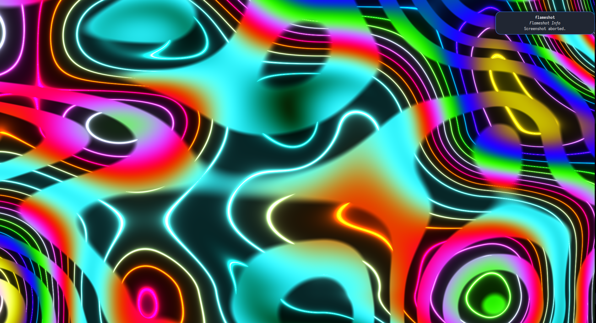

# OpenGLShaderToy
Hot reloading OpenGL Shaders. <br>
Can also be used as a template for OpenGL projects. <br><br>

I will use that repository to share my progress as I learn to code shaders. <br>
I also created a [profile](https://www.shadertoy.com/profile/reavey) on Shader Toy to post my creations. <br>

## Compilation (linux)
To compile you need GLFW, CMake and Make installed on your system.
<br>
If above requirements are fulfilled, just run the following
```bash
mkdir build && cd build
cmake .. && make
./toy
```
<br>

## Screenshots
<p style="justify-content: center; align-items: center;">
  
  
</p>
